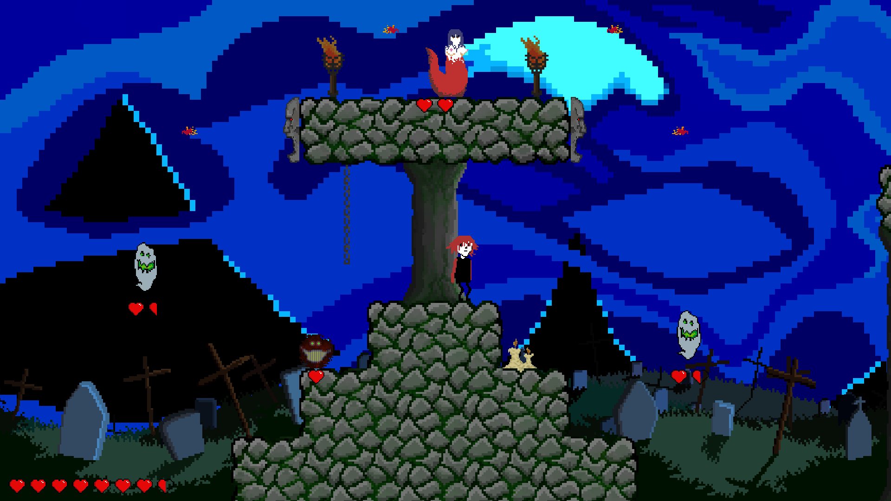
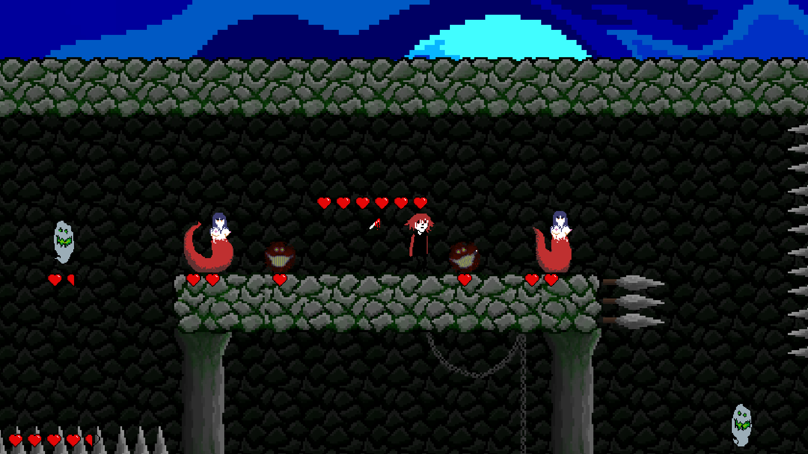
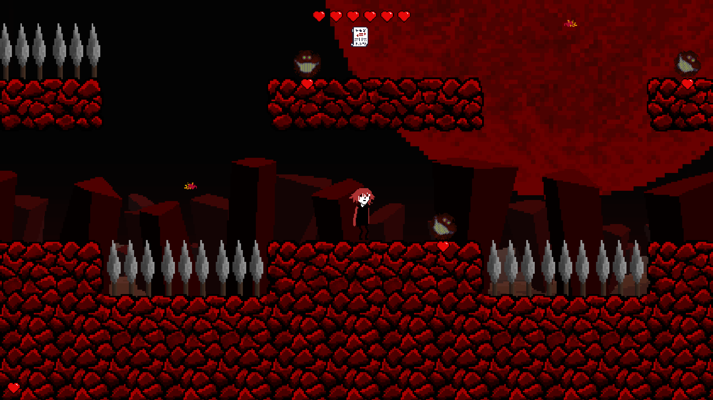
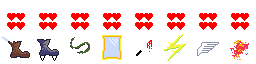
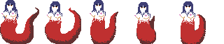
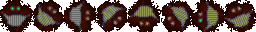
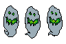
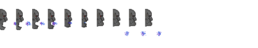

# Stabman
Post-jam version of our [Ludum Dare 44 game jam entry][ludumdare].  

## Screenshots

</img>

</img>

</img>

</img>

[Level One Preview Video][level-one-preview-video]

## Table of Contents
- [Screenshots](#screenshots)
- [Description](#description)
- [Post-Jam Version](#post-jam-version)
  - [Post-Jam Version Downloads](#post-jam-version-downloads)
- [Jam Version](#jam-version)
  - [Jam Version Downloads](#jam-version-downloads)
- [Running the Game](#running-the-game)
  - [Running on Windows](#running-on-windows)
  - [Running on Linux](#running-on-linux)
- [Controls](#controls)
- [Campaign Types](#campaign-types)
  - [Normal Campaign](#normal-campaign)
  - [Bonus Campaigns](#bonus-campaigns)
- [Items](#items)
- [Enemy Types](#enemy-types)
  - [Normal Enemy](#normal-enemy)
  - [Charger Enemy](#charger-enemy)
  - [Flying Enemy](#flying-enemy)
  - [Turret Enemy](#turret-enemy)
- [Changing the window resolution](#changing-the-window-resolution)
- [Development](#development)
  - [Compiling from Source](#compiling-from-source)
    - [With Stable Rust](#with-stable-rust)
    - [With Nightly Rust](#with-nightly-rust)
    - [Available Features](#available-features)
  - [Tools Used](#tools-used)
- [Licensing](#licensing)
  - [Fonts](#fonts)
    - [Undefined Medium](#undefined-medium)
    - [Ruji's Handwriting](#rujis-handwriting)
  - [SDL2](#sdl2)

## Description
The theme for _Ludum Dare 44_ was...  
> Your life is currency

We went for a simple, generic approach:  
_You pay with your health to buy items._

The game is a _2D action-platformer_.  
Your goal is simply to get to the end of each level.  

Throughout the levels you will find _items_ which you can buy using your health as currency.  
See the [items section](#items) for a list of all available items.

You regain health by defeating enemies.

Each level acts as a _checkpoint_; when you die, you restart at the beginning of the level.  
The game will also automatically save your progress to a savefile, each time you beat a level or die.  

When you beat the game, you may choose to start from the beginning again, keeping all your items ("NewGame+"-style).  
Timers for the current level and for the whole game will also appear  
once you start your second play-through on the same savefile.

Most of what's written in this README is directed at the _post-jam_ version.

## Post-Jam Version
After the jam ended at the end of April, we continued working on the game  
with the goal to release a finished product (like always).  
This time, we are proud to say, that we _actually finished this game_!

### Post-Jam Version Downloads
Post-jam version downloads are available on [itch.io][itch-io].

## Jam Version
To see the jam version, visit out our [Ludum Dare page][ludumdare], or  
check out the [`LD44-release`][LD44-release] tag.  

As always with our jam games, we never properly finish.  
This jam's game was _especially unfinished_.  
If you intend to check out our game, we recommend trying our post-jam version.

### Jam Version Downloads
Jam-version binaries are available via Google Drive:

| Platform | Download                        |
|:--------:|:------------------------------- |
| Windows  | [Google Drive][bin-jam-windows] |
| Linux    | [Google Drive][bin-jam-linux]   |

## Running the Game
After downloading the appropriate version for your platform,  
simply unzip the zip-archive and navigate into the unzipped directory.

### Running on Windows
Double-clicking on `Stabman.exe` should start the game!
### Running on Linux
To run it from the terminal, simply execute the `./Stabman` binary.  
To run it from within your GUI file manager, simply double-click on `Start-Stabman`.

## Controls
The exact controls are specified in the file `resources/config/bindings.ron`.  
You can change bindings in this file however you want; the syntax _should_ be self-explanatory enough.  
But careful: if you make a syntax error, the game will crash.  
See the generated file `logs/panic.log` for error messages, if it crashes.

When playing the game casually for the first time,  
we recommend using a controller (if available), or otherwise  
using the keyboard keys marked in __bold__ text,  
as those are probably the most intuitive.  
_These are broad suggestions, feel free to use whatever keys you are comfortable with :)_  
<sup>(If you're trying to beat the bonus levels, you may want to look at the other keyboard control options; controller is _not_ recommended for bonus levels)</sup>

__Note:__  
For the controller buttons we are using the Xbox naming scheme.  
So the `A` button would be the `X` button on a DualShock controller, etc.  

| Action                            | Keyboard                    | Controller                            | Notes                                                                      |
| :-------------------------------- | :-------------------------- | :------------------------------------ | :------------------------------------------------------------------------- |
| Move LEFT                         | __`A`__                     | `DPadLeft`, `JoyStickLeft`            |                                                                            |
| Move RIGHT                        | __`D`__                     | `DPadRight`, `JoyStickRight`          |                                                                            |
| Jump                              | __`Space`__, `K`, `Up`      | `A`                                   | Hold down the jump button for a slower fall (lower gravity).               |
| Attack LEFT                       | __`Left`__, `H`             | `X`                                   |                                                                            |
| Attack RIGHT                      | __`Right`__, `L`            | `B`                                   |                                                                            |
| Buy item                          | __`E`__                     | `Y`                                   |                                                                            |
| Dash                              | __`Shift`__, `J`, `Down`    | `ShoulderButtons` (_left_ or _right_) | Need to hold down movement keys + press dash key; diagonal dashes work; can only dash in-air |
| Toggle pause                      | `P`                         | `Start`                               |                                                                            |
| Start game from main menu         | `Enter`, `Space`            | `A`                                   | Starts the _normal_ campaign, not _bonus_.                                 |
| Continue game from pause menu     | `Enter`, `Space`            | `A`                                   |                                                                            |
| Quit game from main menu          | `Escape`, `Q`, `Backspace`  | `B`                                   |                                                                            |
| Quit to main menu from pause menu | `Escape`, `Q`, `Backspace`  | `B`                                   |                                                                            |

## Campaign Types
There are three campaigns you can play:

### Normal Campaign
The standard, recommended game.  
Includes __10 levels__ total:  
- __3__ in the __overworld theme__, and
- __7__ in the __graveyard theme__.

### Bonus Campaigns
There are two bonus campaigns: __Bonus A__ and __Bonus B__.  

These are collections of super hard levels, with the main focus on hardcore platforming.  
Each of the bonus campaigns includes __3 levels__.  

These campaign types are primarily just meant for us to play.  
But if you're enjoying the game, and are feeling confident enough,  
feel free to give these a try! __>:D__

## Items

</img>  
<em>Item descriptions from left-to-right:</em>  
- __Extra Jump__ _Stackable_  
  Each pickup grants an extra jump in mid-air.  
  When in mid-air, the player can jump additional times.  
  Extra jumps are recharged when standing or sliding on a solid wall.
- __Wall Jump__ _Non-stackable_  
  Grants the ability to jump off walls.  
  When sliding on a wall, press the jump button to jump off of the wall.
- _(unused)_
- __Bullet Deflect__ _Stackable_  
  Grants the ability to deflect enemy bullets by attacking them.  
  Deflected bullets deal one unit of damage.  
  Each pickup increases the deflected bullet's damage by one unit.
- __Damage Up__ _Stackable_  
  Increases attacking damage by one unit.
- __Speed Up__ _Stackable_  
  Increases the player's speed.
- __Jump Height Up__ _Stackable_  
  Increases the maximum height of the player's jump.
- __Bullet Shoot__ _Stackable_  
  Grants the ability to shoot bullets when attacking.  
  Bullets deal one unit of damage.  
  Each pickup increases the bullet's damage by one unit.  
  <sup>Don't worry about the weird name, that's what my dumb brain came-up with during the jam, and we stuck with it :)</sup>
- __Dash__ _Stackable_  
  Each pickup grants the player to use a dash in mid-air.  
  Dashes can only be done in mid-air.  
  Dashes are recharged when standing or sliding on a solid wall.  
  See the [controls section](#controls) for the key to trigger the dash.
- __Knockback Up__ _Stackable_  
  When attacking an enemy, knockback punches the enemy backwards.  
  Each pickup adds additional knockback strength.

## Enemy Types
### Normal Enemy

</img>  
A normal, tank-like enemy.  
Has the most amount of health out of all enemy types;  
walks slowly and hits hard.

### Charger Enemy

</img>  
A small enemy, which will start rolling at the player,  
when they move into its trigger range.  
Once rolling, this enemy will only stop moving upon hitting a wall.

### Flying Enemy

</img>  
This enemy is not affected by gravity.  
It simply tries to follows the player when they are within trigger distance.

### Turret Enemy

</img>  
This enemy cannot be damaged or killed.  
It shoots bullets from its mouth in regular intervals.  
Its bullets can be deflected if the player has picked up the _Bullet Deflect_ item.

## Changing the window resolution
Included with the game's binary, is a file called `resolution.txt`.  
You can specify a custom window resolution in this file.  
Simply write your resolution in the format ...
```
WIDTH x HEIGHT
```
... where `WIDTH` and `HEIGHT` are positive integer numbers.  
Any lines starting with `#` are seen as comments and are ignored.  
See the `resolution.txt` file itself for more information and some preset resolutions.

---

## Development
[](https://travis-ci.org/Noah2610/LD44)
### Compiling from Source
#### With Stable Rust
If you wish to compile the game directly from its source,  
then you will need to have `rust` installed (preferably `rustup`).  
This game is compiled with __Rust version 1.34.2__ (other versions may cause issues).  
After cloning the repository and navigating into its directory,  
compile like so:
```
cargo +stable-1.34.2 run --release
```
(omit the `+stable-1.34.2` part if you do not have `rustup` installed.)  
This will download all dependencies, compile everything, and run the game when it's done.  
This may take a while... You can also omit the `--release` flag for a slightly increased speed at compile-time,  
at the cost of a slightly decreased speed at runtime (FPS may drop below 60).  

#### With Nightly Rust
If you want to run the same setup I ran during development,  
you may compile the game using the provided `bin/run` script.  
You will need to have `rustup` and the `nightly-2019-03-01` toolchain installed for this.  
The benefits for doing this are primarily for development purposes.

#### Available Features
Compiling the game from source, gives you access to some additional features:  
- `controller`  
  Includes amethyst's `sdl_controller` feature, to enable controller support.  
  __Note__: For this feature to work on Windows machines, the `SDL2.dll` file  
  must be included with the binary. This repository redistributes this DLL.  
  It seems to work on Linux without dependencies (?) (tested on a blank VM of Puppy-Linux).  
  _Enabled for pre-compiled binaries:_ __YES__
- `debug`  
  Generate a backtrace and write it to `logs/panic.log`, when a panic occurs.  
  _Enabled for pre-compiled binaries:_ __YES__ <sup>(just in case)</sup>
- `encrypt_savefile`  
  Encrypts the savefile using `base64`.  
  I originally planned to encrypt the savefiles for the final binaries,  
  but in the end decided against this, so players would have the option  
  to mess around with their savefiles.  
  <sup>(not that it would've been difficult to decrypt the base64-encoded variants)</sup>  
  So I kept this feature behind a feature-gate. <sup>(I'm really liking meta-rust :))</sup>  
  _Enabled for pre-compiled binaries:_ __NO__
- `nightly`  
  Can only be used with a nightly rust toolchain.  
  Improves some of amethyt's error messages.  
  _Enabled for pre-compiled binaries:_ __NO__

### Tools Used
- __[Rust]__, programming language
- __[Amethyst]__, engine
- __[Deathframe]__, framework
- __[Vim]__, code editor
- __[GitHub]__, git repository hosting
- __[Gimp]__, tile/background/menu graphics
- __[Aseprite]__, sprite graphics
- __[Bosca Ceoil][BoscaCeoil]__, music
- __[FL Studio][FLStudio]__, music
- __[Tiled]__, level design
- __[Google Drive][GoogleDrive]__, file sharing
- __[Trello]__, task management

---

## Licensing
This project, including all of its code and assets (such as images, audio, level files),  
excluding fonts, are distributed under the terms of the [MIT License][MIT-license].  

### Fonts
The fonts (found under `resources/fonts`) remain unchanged,  
and are licensed individually by their authors.

#### Undefined Medium
- Located at `resources/fonts/undefined-medium.ttf`
- [OFL License][undefined-medium-license]
- [Website][undefined-medium-website]
- [GitHub Repository][undefined-medium-github]
#### Ruji's Handwriting
- Located at `resources/fonts/rujis-handwriting.ttf`
- [OFL License][OFL-license]
- [Author's Website][rujis-handwriting-website]


### SDL2
This project uses and redistributes an unchanged copy of [SDL2],  
for controller support with [amethyst]'s `sdl_controller` feature.  
`SDL2.dll` is distributed under the [zlib license][SDL2-license].

[ludumdare]:                 https://ldjam.com/events/ludum-dare/44/veggietartar
[LD44-release]:              https://github.com/Noah2610/LD44/tree/LD44-release
[bin-jam-windows]:           https://drive.google.com/file/d/1RtQ8vsJFH75WyZHTa1W_vxzchw6OhA7Y/view
[bin-jam-linux]:             https://drive.google.com/file/d/1xffSHQmDppZ4KGcbApzIFt4l_XvT2pX2/view
[bin-dir]:                   https://drive.google.com/open?id=1XNMvBsOJkbbii6jp9T7Du9mNnso00Axn
[Rust]:                      https://www.rust-lang.org/
[Amethyst]:                  https://amethyst.rs/
[Deathframe]:                https://github.com/Noah2610/deathframe
[Vim]:                       https://www.vim.org/
[GitHub]:                    https://github.com/Noah2610/LD44
[Gimp]:                      https://www.gimp.org/
[Aseprite]:                  https://www.aseprite.org/
[BoscaCeoil]:                https://boscaceoil.net/
[FLStudio]:                  https://www.image-line.com/flstudio
[Tiled]:                     https://www.mapeditor.org/
[GoogleDrive]:               https://drive.google.com/
[Trello]:                    https://trello.com/b/hkBWXYt9
[MIT-license]:               https://github.com/Noah2610/LD44/blob/master/LICENSE
[SDL2]:                      https://www.libsdl.org/
[SDL2-license]:              https://www.libsdl.org/license.php
[undefined-medium-website]:  https://undefined-medium.com/
[undefined-medium-github]:   https://github.com/andirueckel/undefined-medium
[undefined-medium-license]:  https://github.com/andirueckel/undefined-medium/blob/master/OFL.txt
[OFL-license]:               https://scripts.sil.org/OFL
[rujis-handwriting-website]: http://rujic.net/
[level-one-preview-video]:   https://youtu.be/zPIvTLLeIPY
[itch-io]:                   https://noahro.itch.io/stabman
